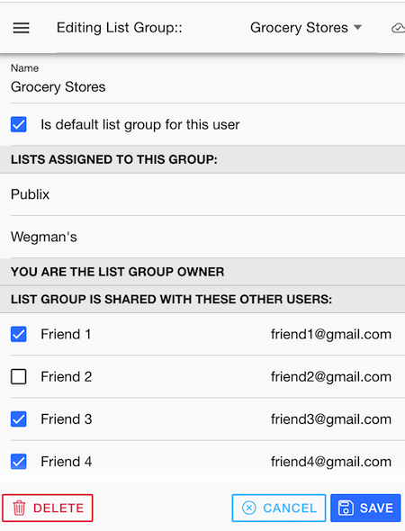

# Lists / List Groups

## List Editor

{align=right width=300}

Within the list editor, you can change the name of the list.  The other key ability here is to re-arrange the categories within the list to represent the physical order that they appear in the store.  This allows the previously shown item screen to be shown in a logical order easy for shopping.  You can re-arrange the items by dragging on the right hand icon and dragging into the new position.

You can also click on the checkbox of the category and move it from the active list to the inactive. You would do this, for example, if the Publix doesn't have an Alcohol section. This works in conjunction with the Setting (shown later) "Add with Same Categories Automatically".

When you first create a list, you can assign it to a list group. After that point it cannot be changed and moved to another list group. 

## List Group Editor

{align=right width=300}
 
In the list group editor, you can change the name of the list group. You likely want to change the name of the default list group that the application creates for you, which would not be very meaningful.

Remember that list groups are also the way that custom lists, items, categories and units of measure are stored. For instance, if you create a custom category "Electrical" in your "Hardware Stores" list group, that category will not exist in your "Grocery Stores" list group unless you create it there as well.

The key thing you can do in this screen is also share the list group with your existing friends (See Friend Editor for more detail).  

Here, if you are the list group owner, you can select those friends you want to share the list group with. This would be common in a multi-family household so everyone can participate in adding items to the same shared shopping list and also being able to shop or check items off. 

Note that the sharing is for the whole list group. You can, however, create a different list group with different sharing options. To do this you would go to the manage list groups screen and press 