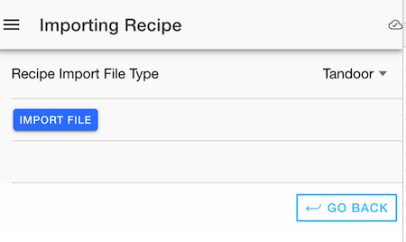
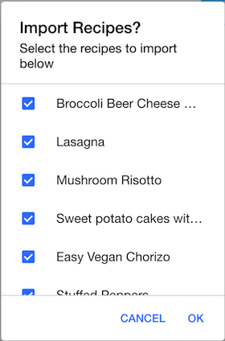
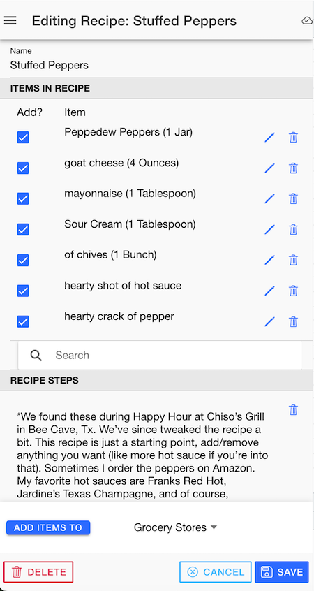

# Recipe Editor

## Recipes

{align=right width=300}

In this app, a recipe is a collection of items and a set of preparation steps.  Each item can either be one of the global items that come with the app, or a custom one for the recipe. Every item has a separate "recipe" and "shopping" unit of measure and quantity. For instance, you might need 2 cups of sugar for the recipe, but you wouldn't buy 2 cups of sugar, but perhaps 1 pound.

## General Approach

Every user of the application will have a special list group created for recipes. The default name until you change it is "username (recipes)". 

Like the other list groups, the name can be edited and you can share the list with other app users once you have a confirmed "friend" relationship in the application.

Unlike the other list groups, you can't "shop" from the recipes list. Instead, you add the items on a given recipe to one of the other shopping lists or list groups.

## Recipe Import

{align=right width=300}

On the Recipes list screen, you can also import a recipe from the Tandoor app. To do so, you would go to the Tandoor app, then export either 1 or a set of recipes -- this would create a .zip file, either on your computer or mobile device. In the recipe import screen, you could then select the .zip file and it would process the available recipes, and import those selected.

{align=right width=300}

During recipe import, if a match cannot be made for unit of measure or other problems occurred, then a note will be added to the individual erroring item.

## Recipe Editor

{align=right width=300}

Here is where you can edit/add/delete items for the recipe on the editor screen. You can search existing items on other recipes or global that can easily be added by clicking on the item in the search bar. Once added, you can click the pencil to edit quantities and units of measure for the recipe prep and shopping.

You can also just add a series of text boxes that act as instructions / recipe prep steps. Next to each item or recipe step, you can press the trash can to delete the item or instruction step.

At the bottom of the screen, you can choose a list or listgroup that you want to add the items to in bulk.  Only those items with a checkmark in the "Add" box will be added to the list. The item will be added to that list if it isn't already on the list. The quantity and unit of measure used will be based on those that are in the "Shopping" quantity and unit of measure for the item rather than the recipe quantity and unit of measure. 