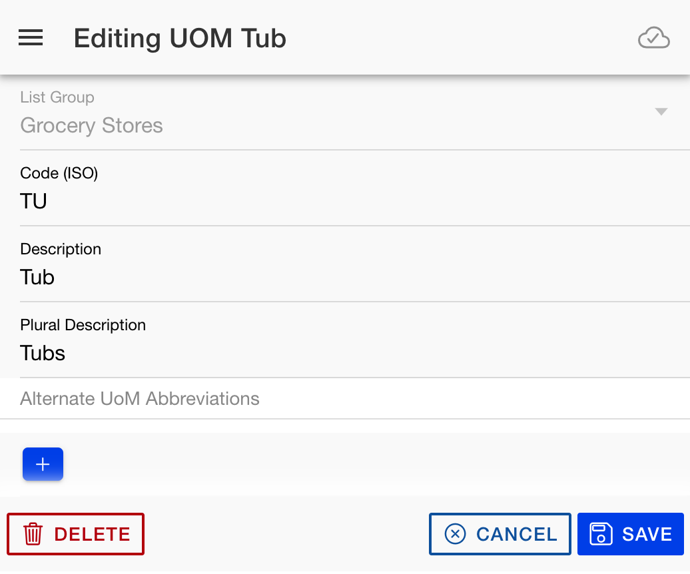

# Units of Measure

{align=right width=300}

The Units of Measure editor allows you to add/edit your custom units of measure. This includes the following fields:

* List Group -- All custom units of measure exist attached to a specific list group.
* Code (ISO) -- This is just a two letter identifier for the unit of measure. All of the built-in units of measure use the standard ISO codes, so those are already taken, but you can use any other available 2 letter/digit code for your own custom units.
* Description / Plural Description -- Used when displaying the units on the item list checkoff screen
* Alternate UOM Abbreviations -- These are primarily used when importing a recipe so that if, for example, the item calls for "6 tbsps" it will correctly match it to the tablespoons unit of measure. Some of these already are added for global units of measure, but you can add more alternates as well.

When editing a unit of measure, press the Save button to accept changes or the cancel button to not save. You can also press the Delete button to delete any of your custom units of measure.
