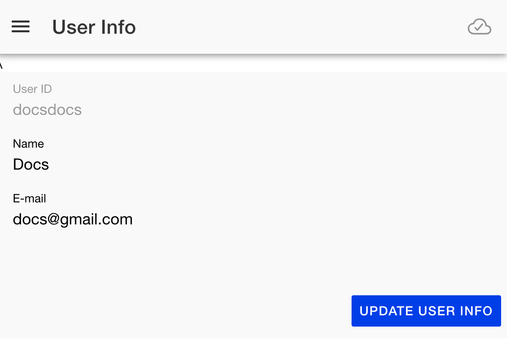

# User Info

{align=right width=300}

The user info page shows you information about the currently logged in user. It also allows you to update the descriptive name and email address associated with the account. This data is used when inviting other friends to list groups and when resetting your password.

If the data is changed, you should press the "Update User Info" button to save the changes.
